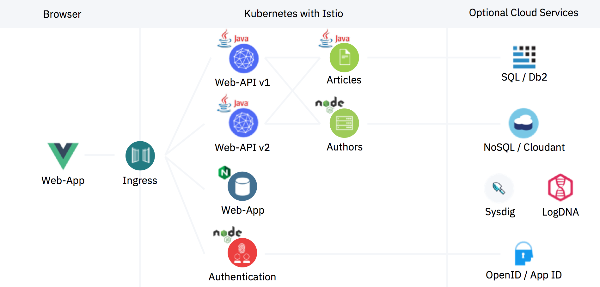
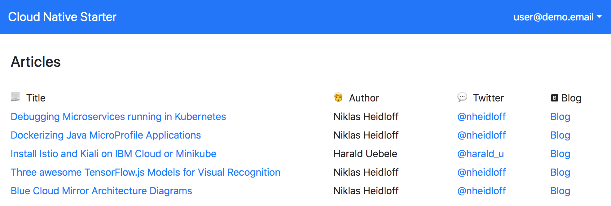
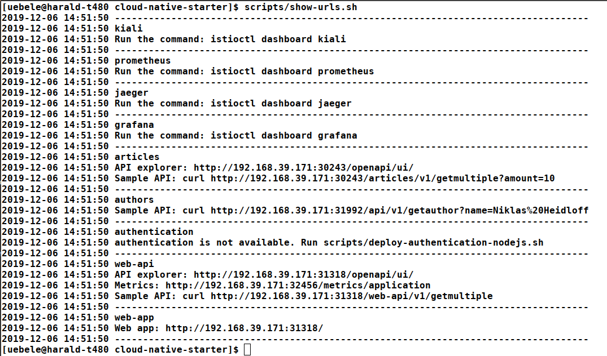
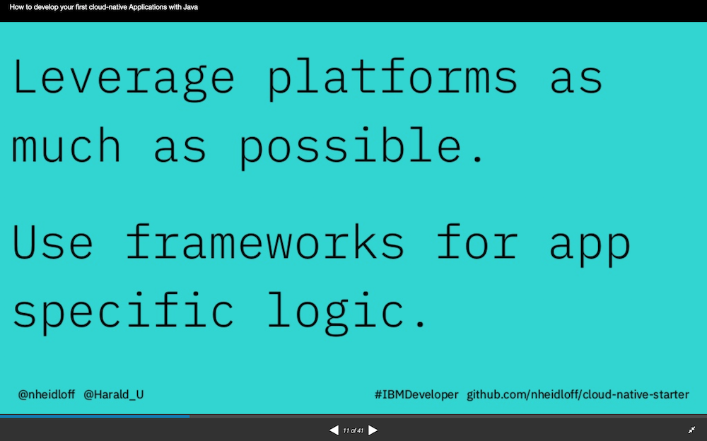

## Cloud Native Starter on Kubernetes and Istio

This project contains sample code that demonstrates how to get started with cloud-native applications and microservice based architectures. 
The project has three parts:

> 1) **Basic concepts:** The documentation of this part is below. Cloud Native Starter demonstrates how to develop complete enterprise applications with ... them with Kubernetes, OpenShift and Istio.


> 2) **Reactive:** The reactive part explains how to use reactive programming and event based messaging in Quarkus applications and how to run them on Kubernetes and OpenShift. For more open the [reactive](reactive) folder and that part can be used completely separately or to get a fast overview of the reactive part, use the [reactive landing page](https://cloud-native-starter-reactive.mybluemix.net/).

> 3) **Security:** The security part explains how to do authentication and authorization in Quarkus applications with Keycloak and how to do network encryption with Istio. For more open the [security](security) folder and that part can be used completely separately. 

### Basic concepts

The first part of the project focusses on how to build microservices 

The microservices can easily be deployed on Kubernetes environments running [Istio](https://istio.io/) like [Minikube](https://kubernetes.io/docs/setup/minikube/), [IBM Cloud Kubernetes Service](https://www.ibm.com/cloud/container-service), Red Hat OpenShift in [CodeReady Containers](https://developers.redhat.com/products/codeready-containers/overview) or [OpenShift on the IBM Cloud](https://cloud.ibm.com/docs/containers?topic=containers-openshift_tutorial).

The project showcases the following functionality:

* [Containerized Java EE Microservices](documentation/DemoJavaImage.md)
* [Exposing REST APIs](documentation/DemoExposeRESTAPIs.md)
* [Consuming REST APIs](documentation/DemoConsumeRESTAPIs.md)
* [Traffic Routing](documentation/DemoTrafficRouting.md)
* [Resiliency](documentation/DemoResiliency.md)
* [Authentication and Authorization](documentation/DemoAuthentication.md)
* [Metrics](documentation/DemoMetrics.md)
* [Health Checks](documentation/DemoHealthCheck.md)
* [Configuration](documentation/DemoConfiguration.md)
* [Distributed Logging and Monitoring](documentation/DemoDistributedLoggingMonitoring.md)
* [Persistence with Java Persistence API (JPA)](documentation/DemoJPA.md)

This diagram shows the key components:

<kbd></kbd>

The next screenshot shows the web application. More screenshots are in the [images](images) folder.

<kbd></kbd>


### Setup

The sample application can be run in four different environments:

1) **Minikube** (locally): See instructions below
2) **IBM Cloud Kubernetes Service** - see [instructions](documentation/IKSDeployment.md)
3) **CodeReady Containers** (Red Hat OpenShift locally) - see [instructions](documentation/OS4Cluster.md)
4) **Red Hat OpenShift on the IBM Cloud** - see [instructions](documentation/OS4Cluster.md)

The following instructions describe how to install everything locally on **Minikube**.

**Important:** Before the microservices can be installed, make sure you've set up Minikube and Istio correctly or follow these [instructions](documentation/SetupLocalEnvironment.md) to set up Minikube and Istio from scratch. This should not take longer than 30 minutes.

Before deploying the application, get the code:

```
$ git clone https://github.com/softaav325/kubernetes.git
$ cd kubernetes
```

The microservices can be installed via scripts. In addition to Minikube and Istio you need the following tools to be available.

Prerequisites:

* [docker](https://docs.docker.com/install/)
* [git](https://git-scm.com/book/en/v2/Getting-Started-Installing-Git)
* [curl](https://curl.haxx.se/download.html)
* [kubectl](https://kubernetes.io/docs/tasks/tools/install-kubectl/)

Docker always needs to be installed locally. The tools git, curl and kubectl (and ibmcloud) can be installed locally or you can use a [Docker image](https://github.com/IBM/cloud-native-starter/blob/master/workshop-one-service/1-prereqs.md#tools) that comes with these tools.

```
$ docker run -v ./kubernetes:/root -it --rm kube
```

Deploy (and redeploy):

```
$ scripts/check-prerequisites.sh
$ scripts/deploy-articles-java-jee.sh
$ scripts/deploy-web-api-java-jee.sh
$ scripts/deploy-authors-nodejs.sh
$ scripts/deploy-istio-ingress-v1.sh
$ scripts/deploy-web-app-vuejs.sh
$ scripts/show-urls.sh
```

After running the scripts above, you will get a list of all URLs in the terminal.

<kbd></kbd>

Example URL to open the web app: http://192.168.99.100:31380

Example API endpoint: http://192.168.99.100:31380/web-api/v1/getmultiple

At this point you have seen the "base line" of our Cloud Native Starter. The following documents describe how to implement additional functionality:

* [Containerized Java EE Microservices](documentation/DemoJavaImage.md)
* [Exposing REST APIs](documentation/DemoExposeRESTAPIs.md)
* [Consuming REST APIs](documentation/DemoConsumeRESTAPIs.md)
* [Traffic Routing](documentation/DemoTrafficRouting.md)
* [Resiliency](documentation/DemoResiliency.md)
* [Authentication and Authorization](documentation/DemoAuthentication.md)
* [Metrics](documentation/DemoMetrics.md)
* [Health Checks](documentation/DemoHealthCheck.md)
* [Configuration](documentation/DemoConfiguration.md)
* [Distributed Logging and Monitoring](documentation/DemoDistributedLoggingMonitoring.md)
* [Persistence with Java Persistence API (JPA)](documentation/DemoJPA.md)


### Cleanup

Run the following command to delete all cloud-native-starter components from Istio.

```
$ scripts/delete-all.sh
```

You can also delete single components:

```
$ scripts/delete-articles-java-jee.sh
$ scripts/delete-articles-java-jee-quarkus.sh
$ scripts/delete-web-api-java-jee.sh
$ scripts/delete-authors-nodejs.sh
$ scripts/delete-web-app-vuejs.sh
$ scripts/delete-istio-ingress.sh
```

### Documentation - Overview

The following [slides](https://github.com/nheidloff/cloud-native-starter/blob/master/documentation/OneHourTalk.pdf) summarize this repo:

[](documentation/OneHourTalk.pdf)

* [Project Description and Design Principles](http://heidloff.net/article/example-java-app-cloud-kubernetes)
* Presentation at We Are Developers (30 mins): [How to develop your first cloud-native Applications with Java](http://heidloff.net/recording-of-talk-how-to-develop-your-first-cloud-native-applications-with-java/)
* Recording of Jakarta Tech Talk (45 mins): [How to develop your first cloud-native Applications with Java](http://heidloff.net/article/recording-jakarta-tech-talk-how-to-develop-microservices/)
* Recording of code.talks session in German: [Wie entwickle ich meine ersten Cloud-nativen Applikationen mit Java?](https://www.youtube.com/watch?v=oabKnZO2mUA)
* [Hands-on workshop with MicroProfile, Kubernetes and Istio](https://github.com/IBM/cloud-native-starter/tree/master/workshop) (three hours)
* [Hands-on workshop YouTube playlist](https://ibm.biz/Bdzpdp)(6 * 3 min)
* [Hands-on workshop build and deploy one microservice using Java, MicroProfile and Kubernetes](https://github.com/IBM/cloud-native-starter/tree/master/workshop-one-service) (one hour)

